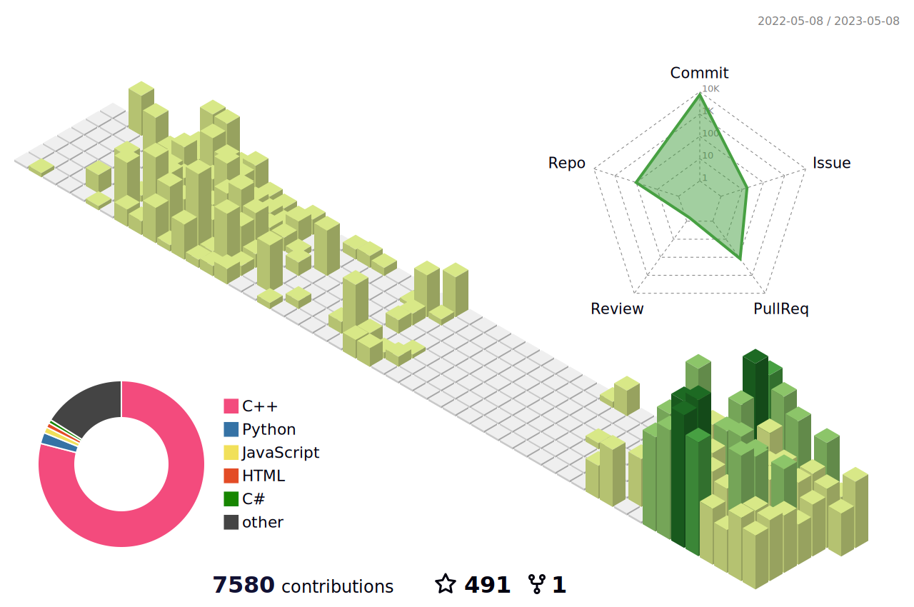

# Parth Sharma 
### My name is Parth Sharma, and I'm a Penetration Tester. I specialize in assessing the security of IT networks and systems by identifying weaknesses.

⤷ Experienced Security Analyst and Penetration Tester who has extensive experience with penetration testing, vulnerability analysis, security audits, and security architectures. Expert in uncovering and mitigating vulnerabilities within a network.

⚐ Living in India

ϟ Currently Security Analyst & Penetration Tester

ϟ Recently Found out security vulnerability at Lenovo

 <br.?

 

 

## Tasks To Be Done

- [x] Born
- [ ] Got a job
- [ ] Married
- [ ] Have children
- [ ] Die

## ✨ Github Statistics 

  
Stats 🔥

  

  
 
  
 
  
 
  
 
  

 

 

## LeetCode Stats Card 🥇 

<!--  -->
<!--  -->

 

## 💭 Quote of the day

  
See quote 👒

  
 

## What about a joke ?

## 🔥 My Motto

  
Check!

&nbsp; &nbsp; &nbsp; &nbsp; &nbsp; &nbsp;&nbsp; 
	

### Spotify 🎧

 

  

  

